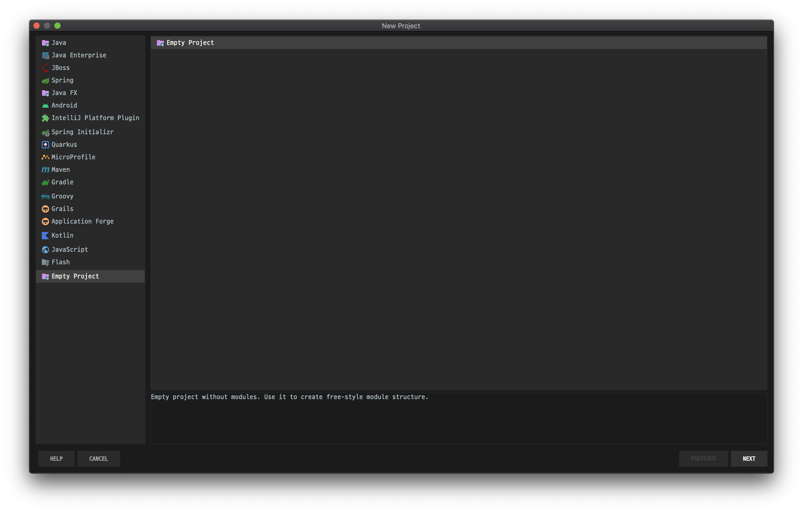
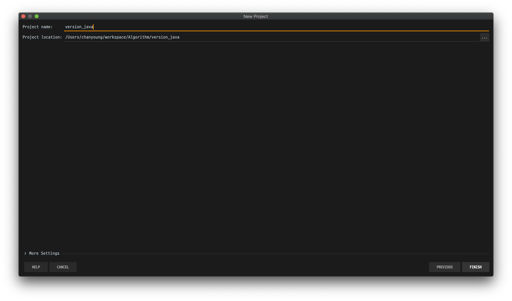
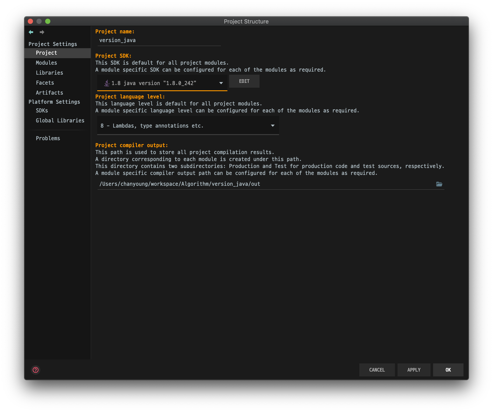

# Algorithm Java

## 환경 셋팅

- IDE : IntelliJ IDEA
- 프로젝트 셋팅
    - 자바 프로젝트 생성
    
    - 작업할 프로젝트 폴더(workspace) 지정
    
    - SDK 설정 (1.8 java version "1.8.0_242")
    - Project language level (8 - Lambdas, type annotations etc.)
    

## Java 입출력

### 입력

#### Scanner (java.util.Scanner)

```java
import java.util.Scanner;

class Main {
  public static void main(String[] args) {
    Scanner input = new Scanner(System.in);
    
    input.next();
    input.nextInt();
    input.nextDouble();
    input.nextLine();
  }
}
```

- next()
  - white space 기준으로 한 단어 입력을 받는다.
- next + {자료형}()
  - 자료형에 해당하는 입력을 받는다.
- nextLine()
  - 한 줄을 입력받는다. (**개행문자를 포함한다는 점에 주의**하자.)

> :exclamation: next() 또는 next + {자료형}() 다음에 nextLine()을 쓰게 되면, 입력을 받지 못하고 바로 넘어가는 경우가 있다.
>
> 이는 next()와 next + {자료형}()은 개행문자 이전까지만 입력을 받기 때문에 개행문자를 nextLine()이 입력을 받기 때문이다.