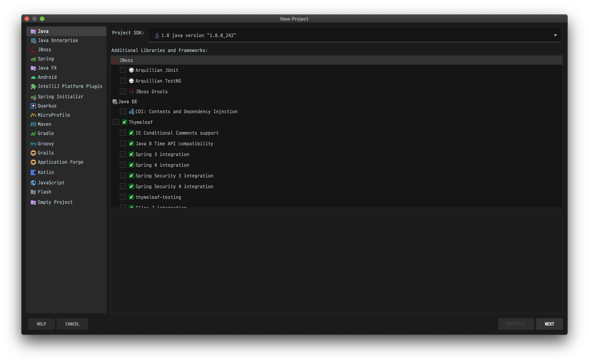

# Algorithm Java

## 환경 셋팅

- IDE : IntelliJ IDEA
- 프로젝트 셋팅
    - 자바 프로젝트 생성
    
    - 작업할 프로젝트 폴더(workspace) 지정
    
    - SDK 설정 (1.8 java version "1.8.0_242")
    - Project language level (8 - Lambdas, type annotations etc.)
    

## Java 입출력

### 입력

#### Scanner (java.util.Scanner)

```java
import java.util.Scanner;

class Main {
  public static void main(String[] args) {
    Scanner input = new Scanner(System.in);
    
    input.next();
    input.nextInt();
    input.nextDouble();
    input.nextLine();
  }
}
```

- next()
  - white space 기준으로 한 단어 입력을 받는다.
- next + {자료형}()
  - 자료형에 해당하는 입력을 받는다.
- nextLine()
  - 한 줄을 입력받는다. (**개행문자를 포함한다는 점에 주의**하자.)

> :exclamation: next() 또는 next + {자료형}() 다음에 nextLine()을 쓰게 되면, 입력을 받지 못하고 바로 넘어가는 경우가 있다.
>
> 이는 next()와 next + {자료형}()은 개행문자 이전까지만 입력을 받기 때문에 개행문자를 nextLine()이 입력을 받기 때문이다.

#### BufferedReader

- Scanner는 `space bar` 와 `enter key` 로 입력을 구분하지만, BufferedReader는 `enter key` 로만 입력을 구분한다.

```java
import java.io.BufferedReader;
import java.io.IOException;
import java.io.InputStreamReader;

class Main {
    public static void main(String[] args) throws IOException {
        BufferedReader br = new BufferedReader(new InputStreamReader(System.in));

        try {
            String[] input = br.readLine().split(" ");
            for (String inputItem : input) {
                System.out.println(inputItem);
            }
        } catch (Exception e) {
            e.printStackTrace();
        } finally {
            br.close();
        }
    }
}

```

- BufferedReader br = new BufferedReader(new InputStreamReader(System.in));

- readLine()

  - 한 줄 단위로 읽는다.

  - split() 또는 StringTokenizer를 이용하여 각 단어를 구분한다.

    ```java
    StringTokenizer st = new StringTokenizer(s); 	// s는 입력받은 문자열
    int a = Integer.parseInt(st.nextToken());
    int b = Integer.parseInt(st.nextToken());
    ```

    

- 기본적으로 String 형식이기 때문에 필요 시 Integer.parseInt()와 같은 함수로 다른 형식으로 변환을 해야 한다.

### 출력

#### System.out.println()

- 기존에 많이 쓰던 출력 방식

```java
class Main() {
  public static voide Main(String[] args) {
    System.out.println("Hello World");
  }
}
```


#### BufferedWriter()

- 위 방식(System.out.println)보다는 빠르다.
- 버퍼를 잡아놓고 쌓아뒀다가 마지막에 모두 출력하기 때문에 효율적이다.

```java
import java.io.*;

public class Test {
    public static void main(String[] args) throws IOException {
        BufferedReader br = new BufferedReader(new InputStreamReader(System.in));
        BufferedWriter bw = new BufferedWriter(new OutputStreamWriter(System.out));
        
        String input = br.readLine();
        
        bw.write(input);
        bw.flush();
        
        br.close();
        bw.close();
    }
}
```

- BufferedWriter bw = new BufferedWriter(new OutputStreamWriter(System.out));
- write()
  - 버퍼에 쓰는 메소드
- flush()
  - 버퍼에 쌓여있는(남아있는) 데이터를 출력하는 메소드